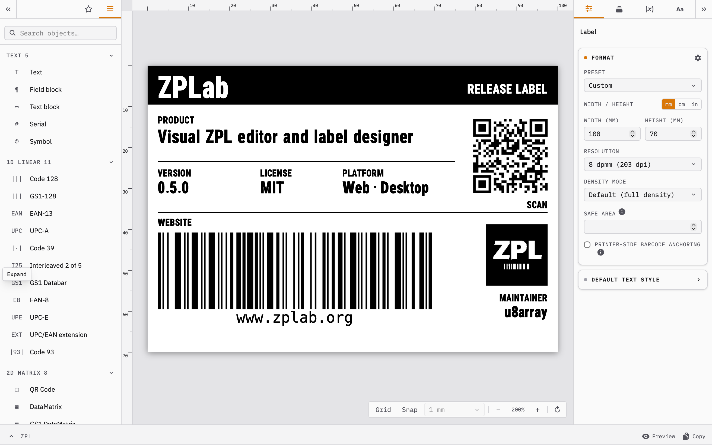

# ZPLab


[](https://github.com/u8array/ZPLab/actions/workflows/deploy.yml?query=branch%3Aprod)
[](https://github.com/u8array/ZPLab/actions/workflows/pr.yml)
[](LICENSE)

ZPLab is a visual ZPL editor and label designer for ZPL-compatible printers, available in your browser and as a local desktop app.

Writing ZPL by hand means cryptic commands, dot coordinates and little visual feedback before the printer runs. Drag objects onto the canvas, adjust their properties, then copy or download the ZPL, which stays visible and editable as you work. The web app runs without installing anything.

Existing ZPL remains editable source rather than becoming a one-way import. ZPLab preserves unchanged source where it can safely do so and regenerates the affected objects, or the whole label, when required (see [Import guarantees](#import-guarantees)). GS1 and EAN/UPC fields include content validation.

**[Try it](https://app.zplab.org/)** · [Download the desktop app](#download) · [Report an issue](https://github.com/u8array/ZPLab/issues)

> **Disclaimer:** This is an independent open-source tool, not affiliated with, endorsed by, or associated with Zebra Technologies Corp. Zebra is a trademark of Zebra Technologies Corp.; all other trademarks are the property of their respective owners.

---

<picture>
  <source media="(prefers-color-scheme: dark)" srcset="docs/screenshot-dark.png">
  <source media="(prefers-color-scheme: light)" srcset="docs/screenshot-light.png">
  
</picture>

---

## Download

| Platform | [v0.5.0](https://github.com/u8array/ZPLab/releases/tag/v0.5.0) |
|---|---|
| Windows | [x64 installer](https://github.com/u8array/ZPLab/releases/download/v0.5.0/ZPLab_0.5.0_x64-setup.exe) |
| macOS | [Apple Silicon](https://github.com/u8array/ZPLab/releases/download/v0.5.0/ZPLab_0.5.0_aarch64.dmg) · [Intel](https://github.com/u8array/ZPLab/releases/download/v0.5.0/ZPLab_0.5.0_x64.dmg) |
| Linux | [AppImage](https://github.com/u8array/ZPLab/releases/download/v0.5.0/ZPLab_0.5.0_amd64.AppImage) · [deb](https://github.com/u8array/ZPLab/releases/download/v0.5.0/ZPLab_0.5.0_amd64.deb) · [rpm](https://github.com/u8array/ZPLab/releases/download/v0.5.0/ZPLab-0.5.0-1.x86_64.rpm) |
| Web (self-hosted) | [zip](https://github.com/u8array/ZPLab/releases/download/v0.5.0/ZPLab_0.5.0_web.zip) |

On macOS, the first launch may be blocked. Allow ZPLab under *System Settings > Privacy & Security*.

On Windows, SmartScreen warns when you first run the unsigned installer. Choose **More info** and then **Run anyway** to continue.

## Usage

### 1. Set up the label

Label dimensions and print resolution are shown in the header of the web build (`width × height mm · dpmm`). Deselect everything by clicking the empty canvas, then edit them in the **Properties** panel.

Set the print resolution (dpmm = dots per millimeter) to match your printer. Common values are 6 dpmm (152 dpi), 8 dpmm (203 dpi), 12 dpmm (300 dpi) and 24 dpmm (600 dpi). Check your printer's manual if unsure; 8 dpmm is the most common.

### 2. Add objects

Drag items from the left panel onto the canvas, or double-click an item to add it centered.

Objects include text, serial counters, barcodes (28 symbologies including Code 128, QR, Data Matrix, PDF417 and MaxiCode), shapes (box, line, ellipse), images and graphic symbols (®/©/™).

<details>
<summary>Full list of supported barcode symbologies</summary>

**1D linear:** Code 128, Code 39, Code 93, Code 11, Interleaved 2 of 5, Standard 2 of 5, Industrial 2 of 5, Codabar, LOGMARS, MSI, Plessey, GS1 DataBar, Planet Code, Postal/POSTNET, EAN-13, EAN-8, UPC-A, UPC-E, UPC/EAN 2- or 5-digit add-on, Code 49

**2D matrix:** QR Code, Data Matrix, PDF417, MicroPDF417, Aztec, CODABLOCK F, MaxiCode, TLC39

</details>

### 3. Edit properties

Select an object to configure its content, size, font and barcode options in the **Properties** panel on the right.

Select multiple objects with Shift-click or by drawing a lasso. Position and size changes apply to all selected objects; a locked object disables resizing for the selection.

### 4. Print or export

The **ZPL** panel at the bottom shows the generated ZPL. It updates in real time, and the code itself is editable.

- **Copy:** copies the ZPL to the clipboard so you can paste it into your printer software
- **Preview:** renders an image via [Labelary](https://labelary.com/) or, on desktop, the connected printer's own firmware (see [Printer settings](#printer-settings))
- **Export ZPL** (File menu): downloads a `.zpl` file
- **Print as Image (browser)** (File menu): opens the Labelary preview and then the browser print dialog. Hidden when Labelary is disabled.

### Editing the ZPL source

The panel provides ZPL syntax highlighting and collapses long blocks of image data. Selecting a canvas object highlights its generated ZPL lines. A notice above the code identifies commands that change persistent printer settings or perform device operations.

The command reference beside the code shows details for the command at the cursor. Search to filter the list, or click a command to keep its details open as you move the cursor. **Insert** adds the command at the cursor, or before the current page's `^XZ` if there is no active cursor.

While you edit the source, the canvas shows a live preview. Canvas editing and the **Properties** panel are disabled, but you can still switch pages. If the source is too large or has mismatched `^XA`/`^XZ` commands, the editor explains the error and does not apply the changes. Mismatched commands are marked in the source.

Leave the panel or press **Apply** to apply your changes. ZPLab asks for confirmation if parsing finds problems or would discard editor settings such as groups, object names, lock and visibility settings, export exclusions or variable bindings. Press `Esc` or **Cancel** to discard your changes; ZPLab asks for confirmation if you have changed the source. Applying source edits imports the revised ZPL again, so the [Import guarantees](#import-guarantees) apply.

### Importing existing ZPL

Choose **File → Import ZPL** to paste ZPL code or open a `.zpl` or `.prn` file.

Import handles text, barcodes, shapes, images (including printer-stored and compressed graphics), label-header settings and template fields. `^FN` slots appear in the **Variables** tab; `^FE` inline embeds such as `^FD#1#-#2#` import as `«name»` markers in the field content.

Commands the parser does not recognize are listed in the import report and do not appear on the canvas. Commands between fields survive export. Commands inside a field are preserved until you edit that object. Regenerating the whole label drops all unrecognized commands on that label.

### Import guarantees

Export uses the original source where it can safely preserve it:

- **Unchanged source:** when the original source can be preserved, importing and exporting without edits reproduces it byte-for-byte, including fields, label settings, comments, whitespace and unsupported commands.
- **Object edits:** the editor generates ZPL for added or changed objects and removes deleted objects. It keeps the remaining source unchanged unless the whole label needs to be regenerated. Changing a label setting regenerates every page if it changes the emitted ZPL. Changing a variable's `^FN` slot number or default value also regenerates every page. Renaming a variable does not.
- **Whole-label regeneration:** some commands affect other fields or need to be rewritten on export. For these labels, the first object edit regenerates the whole page. Examples include `^MU` unit scaling, non-default `^CC`/`^CT` prefixes or a `^CD` delimiter, non-UTF-8 `^CI` encoding, `^FE` or `^FC` outside its field, an `^FN` without a field, `^JM` density switches or `^CF`/`^FW`/`^CW`/`^SO`/`^LH`/`^LT` definitions within an object's source, `^LR`, and barcodes relying on a previous `^BY`. The same applies to Code 128 escape sequences, QR data or settings, and `^FN` embed forms that export normalises. Further triggers are an unused `^FE` or `^FC` at the field's closing `^FS`, an in-field `^FC` with an omitted parameter, and an `^LH` or `^LT` change after the page's first field. Reordering objects also regenerates the label.

If the parser cannot reliably match source fields to objects, export regenerates the label from the imported objects and settings. This can change formatting and omit unsupported commands. The original source is also stored in `.json` designs. If that source was saved in an older, incompatible format, the editor discards it and generates ZPL from the saved objects and settings.

### Multiple labels (pages)

Choose **File → Add page** to create another page. Use the page controls at the bottom of the canvas to switch between pages or remove them. All pages share the same dimensions; export and import handle each page as a separate label.

### Batch printing from data

Choose **File → Import CSV data** (web) or **File → Connect data** (desktop) to load a CSV. In the mapping dialog, assign a column to each variable. The design saves these assignments. **Export batch ZPL** or **Send to Zebra Printer** then produces one label per row.

On desktop, **Connect data** also reads an Excel worksheet. **Settings… → Database connection** loads rows from a read-only SQLite, PostgreSQL or MySQL database, with the password stored in the OS keychain. Assign columns to variables as you would for a CSV. The design saves the database connection so you can reload the data later.

### Printer settings

Choose **File → Settings… → Per Label** to configure media, print quality, output and RFID. Use the **Setup Script** to configure clock, encoding, fonts, printer identity and maintenance when setting up a printer. Saved designs and label exports do not include Setup Script values such as your printer name or locale.

In the **Preview** tab, choose Labelary's online service or, on desktop, the connected printer's firmware. You can also enter a premium Labelary endpoint and API key. The key is stored in the OS keychain on desktop and in browser storage on the web.

### Keyboard shortcuts

| Shortcut | Action |
|---|---|
| `Ctrl/⌘+Z` / `Ctrl/⌘+Shift+Z` | Undo / Redo |
| `Ctrl/⌘+A` | Select all |
| `Ctrl/⌘+C` / `Ctrl/⌘+V` | Copy / Paste |
| `Ctrl/⌘+D` | Duplicate selection |
| `Ctrl/⌘+G` / `Ctrl/⌘+Shift+G` | Group / Ungroup selection |
| `Ctrl/⌘+L` / `Ctrl/⌘+Shift+L` | Lock / Unlock selection |
| `Del` / `Backspace` | Delete selection |
| Arrow keys / `Shift`+Arrow | Move by the snap step (1 dot with snap off); hold Shift to move by 10 mm |
| `G` | Toggle grid |
| `S` | Toggle snap |
| `R` | Rotate view (0° → 90° → 180° → 270°) |
| `Page Up` / `Page Down` | Previous / Next page |
| `Alt/⌥`+click | Cycle selection through stacked objects (select-below) |
| Middle mouse / Space+drag | Pan canvas |
| Scroll | Pan canvas |
| `Ctrl/⌘`+Scroll | Zoom |
| `↑` / `↓` / `Enter` in the command reference | Navigate the list / insert the highlighted command |
| `Esc` in the command reference | Return to following the command at the cursor |

### Saving and loading

Export a `.zpl` file to print or edit again later. To keep editor settings as well, use **File → Save Design** to save a `.json` file. This also stores locked and hidden objects, items excluded from export, custom object names and groups.

---

## Features

- Alignment and spacing guides
- Layers panel with reordering
- Editable ZPL source: type directly in the output panel while the canvas previews the draft live ([editing the ZPL source](#editing-the-zpl-source))
- ZPL command reference: search all 225 catalogued ZPL II commands or view the command at the cursor, with translated explanations and support status
- ZPL source preservation: keep unchanged source when editing imported labels, subject to the [import guarantees](#import-guarantees)
- Variables: define names and default values for text and barcode fields. A field containing only one variable uses `^FN`; variables combined with other content use `^FE`
- Batch printing: map variables to CSV, Excel or read-only database columns, then print or export one label per row
- GS1 content builder: assemble DataBar Expanded, GS1-128 and GS1 DataMatrix content from Application Identifiers, with field and combination validation
- Content builder: create QR, Data Matrix and Aztec codes for plain text, URLs, WiFi, contacts, email, phone, SMS and geographic coordinates
- EAN/UPC inline validation: live length counter, computed check-digit preview, and a GS1 prefix hint for EAN-13
- Printer settings: media, print quality, output and RFID per label, plus a Setup Script for clock, encoding, fonts, identity and maintenance
- 32 UI languages, detected automatically. Change the language in settings or in the web app's header.
- Light / dark mode starts from the OS setting. Change the theme in settings or in the web app's header.
- MCP server (desktop): lets a local AI assistant read and edit the label

---

## Coverage

<!-- coverage:start (generated from the command catalog by scripts/gen-coverage.mjs; run `pnpm coverage:gen`) -->
115 of the 225 ZPL II commands are modelled in the browser; desktop covers 2 more with a connected printer. 4 more are planned for both builds. 82 need a connected printer and are planned for desktop. The source editor checks parameters for 1 command. See per-command coverage: [docs/zpl-coverage.md](docs/zpl-coverage.md).

| Area | Modelled |
|---|---|
| Layout & flow | 15 / 15 |
| Templates & variables | 1 / 3 |
| Barcodes | 29 / 29 |
| Fields | 16 / 17 |
| Serialisation | 2 / 2 |
| Encoding & language | 3 / 3 |
| Clock & time | 4 / 4 |
| Identity & access | 2 / 2 |
| Graphics | 7 / 14 |
| Media & feed | 9 / 9 |
| Text & fonts | 9 / 15 |
| Print quality | 10 / 18 |
| Configuration & persistence | 4 / 5 |
| Hardware / Host comm / RFID / Network | 4 / 89 |
<!-- coverage:end -->

---

## Limitations

- The canvas approximates the printed label. Fonts and rendering can differ from the printer's output. Use **Preview** in the **ZPL** panel to view an image rendered by Labelary or the connected printer over the canvas.
- The default preview renderer is Labelary; the web build calls `api.labelary.com`. Self-hosters can configure a private endpoint or disable online previews at build time (`VITE_THIRD_PARTY_LABELARY=false`). The desktop app can preview on the connected printer instead.
- The Labelary preview does not render every ZPL feature. It ignores CODABLOCK F's `^BB` command and displays the field content as plain text. MaxiCode renders slightly smaller than on a Zebra ZD230.
- **Preview** and **Print as Image (browser)** render only the current page. **Export ZPL** and **Send to Zebra Printer** include every page.

---

## Development

```bash
pnpm install
pnpm dev
```

Requires Node.js ≥ 24 and pnpm (the workspace uses `workspace:*` dependencies that npm cannot resolve).

```bash
pnpm build   # output goes to dist/
```

The web build output is entirely static and can be served from any web server or file host. The desktop app is a [Tauri](https://tauri.app/) shell (`src-tauri/`) that prints over raw TCP or the system spooler on all supported platforms. Direct USB printing is available on Linux and macOS.

### Tech stack

- [React 19](https://react.dev/) + TypeScript
- [Vite](https://vite.dev/)
- [Konva](https://konvajs.org/) / react-konva: canvas rendering
- [Zustand](https://github.com/pmndrs/zustand) + [zundo](https://github.com/charkour/zundo): state and undo history
- [bwip-js](https://github.com/metafloor/bwip-js): barcode rendering
- [Tailwind CSS v4](https://tailwindcss.com/)
- [Tauri](https://tauri.app/): desktop shell (native printing and file dialogs)

### How it works

The editor stores the label as a list of objects in Zustand. On every change, ZPL II is generated client-side by mapping each object to its corresponding ZPL commands. Barcodes are rendered on the canvas using bwip-js. Preview images come from the Labelary API or, on desktop, the connected printer's firmware.

---

## Contributing

Issues and pull requests are welcome.

If a ZPL file imports incorrectly, attach it to the issue and describe the expected result.

---

## License

MIT
